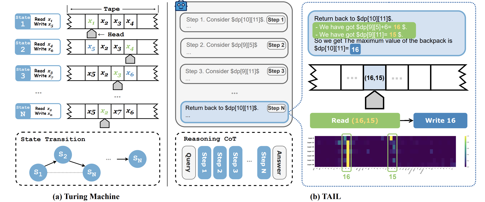
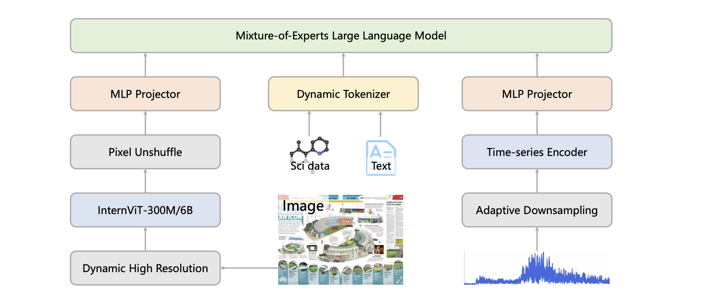

## About Me

Hi👋, I am Zhouqi HUA (华洲琦).

I am a **PhD student** at [Fudan University](https://www.fudan.edu.cn/), in the joint program at [Shanghai AI Laboratory](https://www.shlab.org.cn/), advised by Dr. [Wenwei Zhang](https://zhangwenwei.cn/), Dr. [Kai Chen](https://chenkai.site/) and Prof. [Dahua Lin](https://dahua.site/). Before that, I received the bachelor degree at Tongji University in 2025.
My research focus on **generalization in large language models** (LLMs), including length generalization and compositional generalization.

---

## Latest News
- **[2025.07]** One paper [TAIL](https://arxiv.org/abs/2507.13332) has been rejected by The *Thirty-Ninth Annual Conference on Neural Information Processing Systems* (Neurips 2025).
- **[2025.07]** We release [Intern-S1](https://arxiv.org/abs/2508.15763), an advanced open-source scientific multimodal reasoning model.
- **[2025.07]** We release a new paper [TAIL](https://arxiv.org/abs/2507.13332) proposing a programmatic approach to enhance length generalization in LLMs.

---
## Publications

<!-- 

    
    

        <h3>The Imitation Game: Turing Machine Imitator is Length Generalizable Reasoner</h3>
        
<strong>Zhouqi Hua</strong>, Wenwei Zhang*, Chengqi Lyu, Yuzhe Gu, Songyang Gao, Kuikun Liu, Kai Chen*

        
<em>preprint</em>

        

            <a href="https://arxiv.org/abs/2507.13332" target="_blank">Arxiv</a>
            <a href="https://huggingface.co/papers/2507.13332" target="_blank">HuggingFace</a>
        

    

    
    

        <h3>Intern-S1: An Advanced Open-Source Scientific Multimodal Reasoning Model</h3>
        
<em>(Authors and details here - placeholder)</em>

        
<em>preprint</em>

        

            <a href="https://arxiv.org/abs/2508.15763" target="_blank">Arxiv</a>
            <a href="https://github.com/Intern-S1" target="_blank">GitHub</a>
        

    

 -->

  
  

    <h3 class="publication-title">The Imitation Game: Turing Machine Imitator is Length Generalizable Reasoner</h3>
    
<strong>Zhouqi Hua</strong>, Wenwei Zhang*, Chengqi Lyu, Yuzhe Gu, Songyang Gao, Kuikun Liu, Dahua Lin*, Kai Chen*

    
<em>preprint</em>

    

      <a href="https://arxiv.org/abs/2507.13332" target="_blank">Arxiv</a>
      <a href="https://huggingface.co/papers/2507.13332" target="_blank">HuggingFace</a>
    

  

    
    

        <h3 class="publication-title">Intern-S1: An Advanced Open-Source Scientific Multimodal Reasoning Model</h3>
        
Lei Bai, ..., <strong>Zhouqi Hua</strong>, ..., Dongsheng Zhu, Lin Zhu, Yicheng Zou

        
<em>Technical Report</em>

        

            <a href="https://arxiv.org/abs/2508.15763" target="_blank">Arxiv</a>
            <a href="https://github.com/Intern-S1" target="_blank">GitHub</a>
        

    

---
## Education
- **2021.09 - 2025.06**, **B.Eng.** in Computer Science, **Tongji University**. 
- **2025.09 - Now**, **PhD Student** in Computer Science, **Fudan University**.

---
## Internships
- **2024.01 - Now**, Mayor of [Cities: Skylines II](https://www.paradoxinteractive.com/games/cities-skylines-ii/about) Metropolitan Region  
- **2024.10 - Now**, Research Intern of InternLM Group, [Shanghai AI Lab](https://www.shlab.org.cn/), China.
- **2025.06 - Now**, Supreme Commander [Long Wei](https://baike.baidu.com/item/%E5%A8%81%E9%BE%99/65326207) of [G.T.I Security](https://www.playdeltaforce.com/zh-tw/anti-cheat.html) ([Delta Force](https://www.playdeltaforce.com/zh-tw/))

---
## Invited Talks
Feel free to invite me 😈

---
## Contact Information
- **Email:** [zqhua25@m.fudan.edu.cn](mailto:zqhua25@m.fudan.edu.cn)
- **GitHub:** [github.com/Zhouqi HUA](https://github.com/HuaHenry)
- **Google Scholar:** [GS-ZhouqiHUA](https://scholar.google.com/citations?user=UtSuyOIAAAAJ&hl)